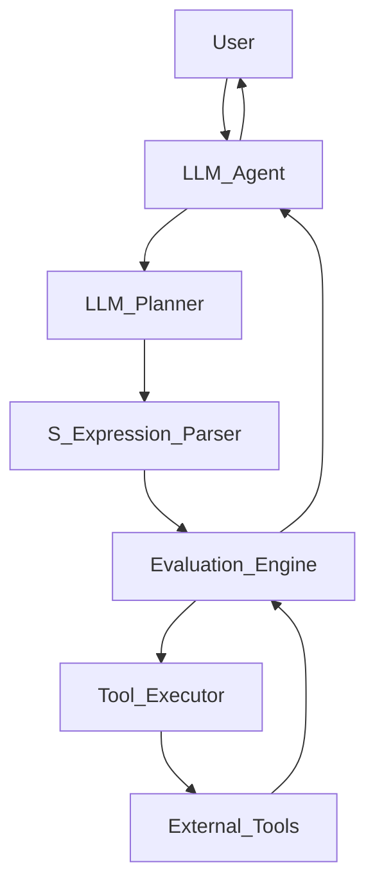

# S式エージェントシステム設計ドキュメント

## 1. S式の詳細な定義

### 1.1. 構文

S式は、以下の形式で表現される。

- アトム: シンボル (例: `step1`, `my-variable`), 文字列 (例: `"Hello"`), 数値 (例: `123`, `3.14`)
- リスト: `(element1 element2 ...)` の形式で、要素はアトムまたはS式。

### 1.2. セマンティクス

- `(plan (seq step1 step2 ...))`: `step1` が完了してから `step2` を実行する、というように、引数のS式を順番に実行する。
- `(plan (par stepA stepB ...))`: `stepA` と `stepB` を並行して実行する。両方のS式が完了するまで待機する。
- `(if cond then else)`: `cond` を評価し、真であれば `then` を、偽であれば `else` を実行する。
- `(let ((var expr) ...) body)`: `expr` を評価した結果を `var` に束縛し、`body` を実行する。束縛は `body` のスコープ内でのみ有効。
- `(notify "msg")`: `msg` をユーザーに通知し、ログにも記録する。
- `(search "query")`: `query` を使って情報を検索し、結果を返す。
- `(calc "2+3*4")`: 数式 `2+3*4` を評価し、結果を返す。
- `(db-query "...")`: データベースクエリ `...` を実行し、結果を返す。

## 2. パーサーの要件定義

- 入力: S式形式の文字列
- 出力: 抽象構文木 (AST) 表現
- 機能: 括弧の対応チェック、アトムとリストの識別、ネストされたS式の解析
- エラーハンドリング: 不正なS式に対するエラー検出と報告

## 3. 評価エンジンの要件定義

- 入力: AST
- 出力: 実行結果 (値、副作用)
- 機能: 
    - `seq` の逐次実行
    - `par` の並列実行 (ThreadPoolExecutorなどを利用)
    - `if` の条件分岐
    - `let` の変数束縛
    - ツール呼び出しのディスパッチ
- エラーハンドリング: 実行時エラーの捕捉と報告

## 4. ツール呼び出しのインターフェース定義

各ツールは、評価エンジンから呼び出される際に、特定のインターフェースを持つ。

- `notify(message: str)`
- `search(query: str) -> str`
- `calc(expression: str) -> Union[int, float]`
- `db_query(query: str) -> Any`

## 5. LLMとの連携方法の検討

- LLMへの入力: ユーザーの要求、現在のタスクの状態、利用可能なツールとその説明
- LLMからの出力: S式形式の計画
- プロンプト設計: LLMが適切なS式を生成できるように、明確な指示と例を含むプロンプトを作成する。

## 6. システム全体のアーキテクチャ設計

- **LLM Agent**: ユーザーからの入力を受け取り、LLM Plannerに渡す。実行結果をユーザーに返す。
- **LLM Planner**: LLMを呼び出し、S式形式の計画を生成する。
- **S-Expression Parser**: LLM Plannerが生成したS式を解析し、ASTに変換する。
- **Evaluation Engine**: ASTを実行し、S式のセマンティクスに従ってツールを呼び出す。
- **Tool Executor**: 各ツール (search, calc, db-query, notifyなど) の具体的な実行を担当する。
- **External Tools**: 検索エンジン、計算機、データベースなどの外部サービス。

